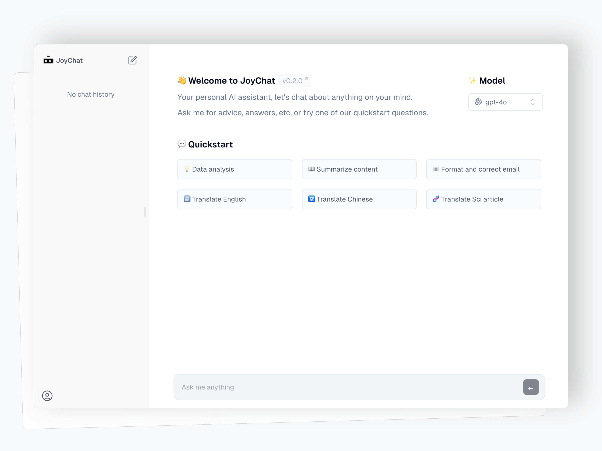

<a href="https://joychat.io">
  <h1 align="center">JoyChat</h1>
</a>

<p align="center">
  A Beautiful Design, customizable, personal AI chatbot built with Next.js, Vercel AI SDK, OpenAI, and Supabase.
</p>

<p align="center">
  <a href="#features"><strong>Features</strong></a> ·
  <a href="#model-providers"><strong>Model Providers</strong></a> ·
  <a href="#deploy-your-own"><strong>Deploy Your Own</strong></a> ·
  <a href="#running-locally"><strong>Running locally</strong></a> ·
  <a href="#thanks"><strong>Thanks</strong></a>
</p>
<br/>

## Features

- 🔒 Secure: Data stored locally in the browser or in the Cloud.
- 🌟 Beautiful Design: Responsive design and dark mode.
- ✍️ Markdown Support: Includes code highlighting and more.
- 🌐 Provider Flexibility: Supports providers other than OpenAI.
- 🚀 Quick Start: System prompt and quickstart templates available.
- 👥 Shareable: Easily share your chat with friends.
- 📊 Quality Feedback: Measured quality through user feedback (Cloud version).
- 💰 Cost Tracking: Track token usage and costs (Cloud version).
- 🛠️ Tool Integration: Chat with files, compatible with Anthropic and Groq models (🚧 under construction).

## Usage

  👋 Hey there, you can use [joychat.io](https://joychat.io/) for **Free** as long as my OpenAI key quota allows it. If it exceeds what I can afford later, I will consider limiting frequency of use. My goal is to build a beautiful, helpful personal AI assistant, feel free to start a conversation and give feedback.

## Stacks

- [Next.js](https://nextjs.org) App Router
- [Supabase](https://supabase.com/) for Cloud Database
- [Vercel AI SDK](https://sdk.vercel.ai/docs) for streaming chat UI
- Styling with [shadcn/ui](https://ui.shadcn.com) and [Tailwind CSS](https://tailwindcss.com)
- [NextAuth.js](https://github.com/nextauthjs/next-auth) for authentication
- [LangFuse](https://langfuse.com/) for metrics and measure token cost

## Model Providers

By default, it supports OpenAI gpt-4o. Adaptations for other models such as Anthropic, Cohere, Hugging Face, and those using LangChain are currently being added.

## Deploy Your Own

You can deploy your own version AI Chatbot to Vercel with one click:

[](https://vercel.com/new/clone?demo-title=JoyChat&demo-description=A+full-featured%2C+hackable+Next.js+AI+chatbot+built+by+0xinhua&demo-url=https%3A%2F%2Fjoychat.io&demo-image=%2F%2Fimages.ctfassets.net%2Fe5382hct74si%2F4aVPvWuTmBvzM5cEdRdqeW%2F4234f9baf160f68ffb385a43c3527645%2FCleanShot_2023-06-16_at_17.09.21.png&project-name=Next.js+Chat&repository-name=my-joychat&repository-url=https%3A%2F%2Fgithub.com%2F0xinhua%2Fjoychat&from=templates&skippable-integrations=1&env=OPENAI_API_KEY%2CAUTH_GITHUB_ID%2CAUTH_GITHUB_SECRET%2CAUTH_SECRET&envDescription=How+to+get+these+env+vars&envLink=https%3A%2F%2Fgithub.com%2Fvercel-labs%2Fai-chatbot%2Fblob%2Fmain%2F.env.example&teamCreateStatus=hidden&stores=[{"type":"kv"}])

## Running locally

You will need to use the environment variables [defined in `.env.example`](.env.example) to run this Chatbot. It's recommended you use [Vercel Environment Variables](https://vercel.com/docs/projects/environment-variables) for this, but a `.env` file is all that is necessary.

> Note: You should not commit your `.env` file or it will expose secrets that will allow others to control access to your various OpenAI and authentication provider accounts.

1. Install Vercel CLI: `npm i -g vercel`
2. Link local instance with Vercel and GitHub accounts (creates `.vercel` directory): `vercel link`
3. Download your environment variables: `vercel env pull`

```bash
pnpm install
pnpm dev
```

Your app template should now be running on [localhost:3000](http://localhost:3000/).

## Data Storage

You can configure how your chat data is stored by setting the `NEXT_PUBLIC_STORAGE_MODE` environment variable in your `.env` file:

- **local**: This mode saves chat data directly in your browser's local storage.
- **cloud**: This mode syncs chat data to Supabase, a cloud-based PostgreSQL database.

Example:

```env
# Data storage mode: "local" for browser storage, "cloud" for Supabase storage
NEXT_PUBLIC_STORAGE_MODE="local"
```

To use Supabase for cloud storage, change the mode to `"cloud"`:

```env
NEXT_PUBLIC_STORAGE_MODE="cloud"
```

If you choose the cloud mode, you need to configure the corresponding database table structure on Supabase. For detailed instructions, refer to this [documentation](./supabase/README.md).

## Thanks

The initial version of JoyChat is based on [ai-chatbot](https://github.com/vercel/ai-chatbot) created by the team behind Vercel.
Thanks for providing this awesome ai chatbot template!

## License

[MIT](https://github.com/0xinhua/joychat?tab=MIT-1-ov-file)
